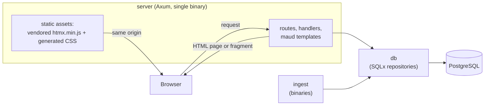

# Architecture

This document is the map of the codebase: the pieces, how they fit, and the invariants that hold them
together. It is deliberately high-level. For exact table and column names, content rules, the design
system and conventions, see [`CLAUDE.md`](./CLAUDE.md).

## Shape

open-public is one Rust binary plus one PostgreSQL database. There is no separate search engine, no
message queue, no service mesh, and no client-side framework. Postgres handles both relational data
and full-text search, and the binary server-renders every page. This is a deliberate constraint: one
binary and Postgres until it hurts.

The client runs no application code of ours. HTMX (a single vendored script) turns ordinary links and
forms into partial-page requests; the server answers those with small HTML fragments instead of a full
page. Nothing depends on JavaScript being present.

## Crates and dependency direction

The workspace is four crates. Dependencies point one way; nothing lower depends on anything higher.

- **`domain`** holds the project's vocabulary: shared types and pure, locale-aware text helpers (slug
  generation, casing). It has no SQLx and stays dependency-light, so every other crate can depend on
  it freely. Pure helpers here are unit-tested.
- **`db`** holds every SQL query and repository function, using SQLx with compile-time-checked
  queries. Nothing above this layer writes SQL; the `db` API is the only way to touch Postgres.
- **`server`** is the Axum binary and the deployable artifact. It holds the request handlers, the
  `maud` HTML templates (one page per handler), the reusable `ui` component functions (layout, cards,
  badges, timeline entries, the poll widget, source links), and the static assets (the vendored HTMX
  script and the generated Tailwind CSS). Handlers are thin: validate input, call a `db` function,
  render a template. No inline SQL lives here.
- **`ingest`** holds standalone data-import binaries (for example, the Wikidata seed). They depend on
  `domain` and `db` and run outside the request path.

## Data model invariants

Two rules are enforced everywhere, including in seed data and test fixtures:

1. **Every fact references a source.** Each row that asserts a fact (a person, party, role,
   membership, statement, or news item) carries a `source_id` into the `sources` table. No source,
   no insert.
2. **Time-varying facts are relations, not columns.** Party membership, roles and positions are
   stored with `start_date`/`end_date` (a `NULL` end means "current"), never as a mutable flat field.
   The record of *when* something was true is never overwritten.

Full-text search is Postgres-native: `tsvector` indexes over the searchable text columns, queried
through the `db` layer. There is no external index to keep in sync.

## Request lifecycle

A request enters the `server` binary and is routed to a handler. The handler validates its input,
fetches data through `db` repository functions (compile-time-checked queries against Postgres), and
renders a `maud` template into HTML. A normal navigation returns a complete page; an HTMX-driven
interaction returns just the fragment that changed, which HTMX swaps into the DOM. Because every page
is fully rendered server-side and every enhanced interaction has a plain-form fallback, the site works
without JavaScript.

## Styling and assets

Styling is Tailwind CSS compiled by the standalone Tailwind CLI into a single stylesheet, served as a
static asset. HTMX is vendored into the static directory and served from the same origin, with no CDN
and no external font host. The interface is deliberately near-monochrome; the only saturated color on
a page comes from data (such as a party badge).

## Ingestion

Ingest binaries are idempotent: they upsert on external identifiers (such as `wikidata_id`), so
running them twice never duplicates rows. They rate-limit per host, send a descriptive User-Agent with
contact information, respect `robots.txt`, and never fetch paywalled content. When two sources
disagree, the discrepancy is written to `data_conflicts` rather than overwriting the existing value,
following the project's source-trust order.

## Accounts, voting, and identity

Participation runs on lightweight accounts. A person registers with an email and a password: the
password is stored only as an argon2 hash, and the email is never kept in plaintext, only as an HMAC
hash keyed by a server secret. Registration is not finished until the address is confirmed. A one-time
verification link is mailed out, and login is refused until it is used. Sessions are opaque random
tokens; only their SHA-256 hash is stored server-side, and the cookie is `HttpOnly`, `SameSite=Lax`,
and `Secure` when the site is served over https.

One vote per account per poll is enforced by a uniqueness constraint, and `poll_votes` rows are never
updated or deleted, not even by admins. Corrections happen by closing a poll and opening a new one.
Poll results always carry an "informal, not a representative survey" label: verification deduplicates
accounts but does not make the sample representative. Registration, verification, and login are rate
limited at the edge (reverse proxy), not in the application.

## Migrations and offline builds

Migrations are SQLx migrations and are **append-only**: an applied migration is never edited. The
`.sqlx/` offline query metadata is committed to the repository so that CI (and any build) can compile
the compile-time-checked queries with `SQLX_OFFLINE=true` and no live database.

## Deployment interface

The repository's deployment interface is intentionally narrow: a multi-stage Docker image plus a set
of documented environment variables (database URL, mail settings, the HMAC secret). Concrete hosting,
DNS and infrastructure live outside this repository and are never committed.

## Verifiable builds

The release path is auditable end to end, so anyone can check that a running instance corresponds to a
specific public commit.

- On a `v*` tag, the public `release.yml` workflow builds the image and generates a build-provenance
  attestation (`actions/attest-build-provenance`) that binds the source commit and the workflow run to
  the resulting image digest. The attestation is pushed to the registry and can be checked with
  `gh attestation verify`.
- Every third-party action in the workflows is pinned to a full commit SHA, so a moved tag cannot
  silently change what the build does.
- Images are referenced by digest, never by a mutable tag; deployment pulls by digest.
- The server exposes `GET /version`, which returns the commit and build timestamp (baked into the
  binary at build time, never read from `.git` at run time) and the image digest (supplied at run time
  by the deployment). `GET /health` is a liveness probe.

The chain is: source commit, then public build workflow, then attested image digest, then `/version`
reporting that digest. Each link can be checked on its own.
